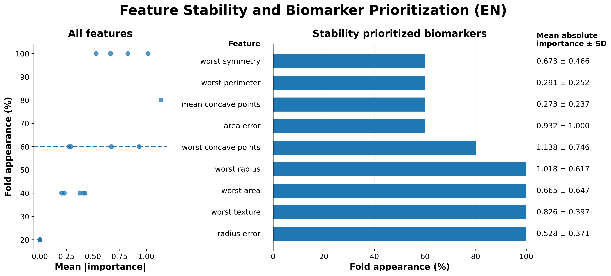
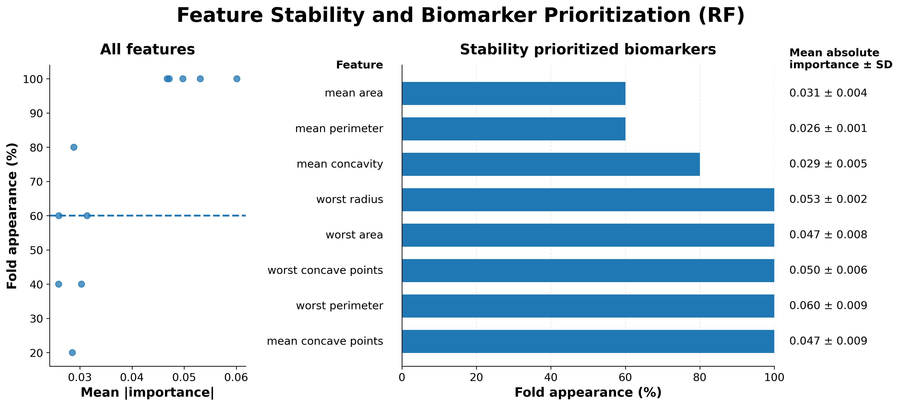
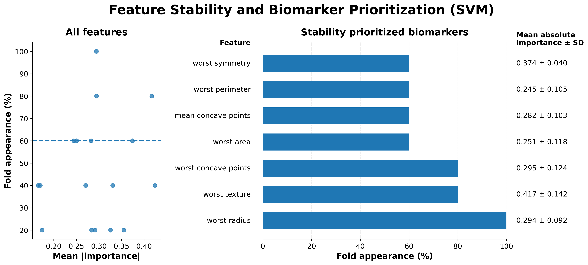
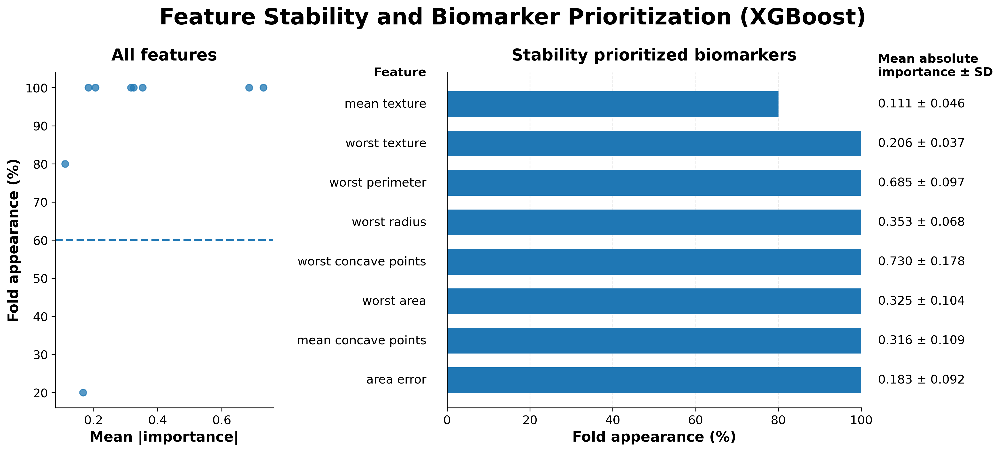
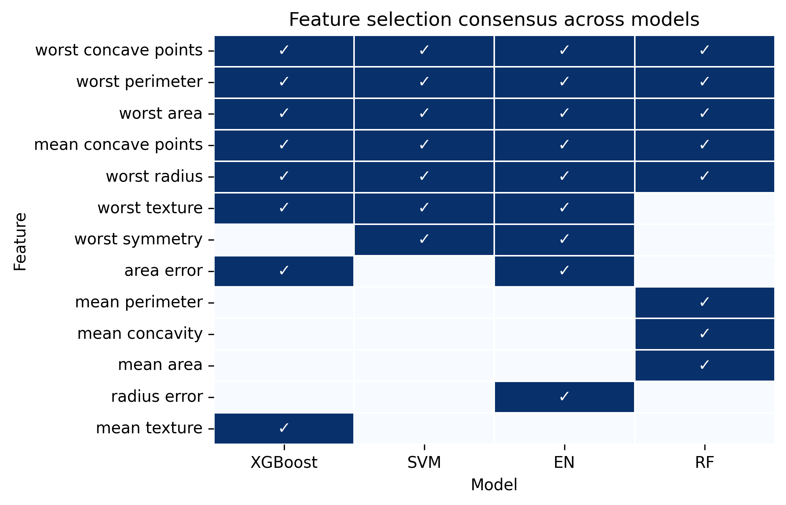

# Stability-Driven Biomarker ML

A machine learning framework for stability-driven biomarker prioritization using cross-validation feature importance, feature stability, and multi-model consensus analysis.

## Overview

Biomarker discovery studies often rely on a single machine learning model, which can introduce model-specific feature selection bias and unstable biomarker prioritization.

This repository implements a cross-model stability framework that identifies biomarkers consistently selected across:

- Multiple machine learning algorithms
- Cross-validation folds

The framework integrates regularized linear and nonlinear machine learning models to improve robustness, interpretability, and reproducibility for translational multi-omics applications.

## Key Features

- Multi-model biomarker discovery pipeline
- Stability-driven feature prioritization using a nested cross-validation framework
- Inner cross-validation for hyperparameter tuning
- Outer cross-validation for feature importance and stability assessment
- Cross-model consensus analysis to reduce model-specific feature selection bias
- SHAP and model-specific feature importance support for interpretable machine learning
- Publication ready visualizations for biomarker stability, cross-model consensus analysis, and model performance
- Modular and extensible Python implementation for translational multi-omics workflows
 
## Supported Models

- Elastic Net (EN)
- Random Forest (RF)
- XGBoost
- Support Vector Machine (SVM)

The pipeline is modular and extensible, allowing integration of additional machine learning models and feature selection strategies.

## Method Overview

```text
Input data and customized model hyperparameters
        ↓ 
Preprocessing and scaling 
        ↓
(Optional feature selection with Lasso)
        ↓ 
Nested cross-validation with multi-model training
        ↓ 
Feature importance ranking
        ↓ 
Cross-fold feature importance and stability analysis 
        ↓ 
Cross-model consensus aggregation 
        ↓ 
Robust biomarker prioritization
        ↓
Model evaluation using selected biomarkers on independent hold-out test data
```

## Repository Structure
```text
stability-driven-biomarker-ml/
├── src/           # Core biomarker discovery framework
├── scripts/       # Example analysis workflows
├── configs/       # Customizable model hyperparameter configuration files
├── outputs/       # Generated figures and result tables
├── LICENSE
├── README.md
├── requirements.txt
└── pyproject.toml
```

## Installation
```bash
git clone https://github.com/lingdi-zhang/stability-driven-biomarker-ml.git
cd stability-driven-biomarker-ml
pip install -e .
```

## Requirements
- Python 3.10+
- pandas
- numpy
- scikit-learn
- xgboost
- shap
- matplotlib
- seaborn
- upsetplot

## Example Python Usage:
### Read in customized or default model hyperparameters

```python
from  biomarkerML_pipeline import BiomarkerMLPipeline
import pandas as pd
outer_cv_params = pd.read_csv("configs/model_params.txt",sep="\t")
feature_selection_model_params=pd.read_csv("configs/feature_selection_params.txt",sep="\t")
```
### Initiate the Pipeline
```python
run_pipeline=BiomarkerMLPipeline(
	outer_cv_params,
	output_dir=output_dir
)
```
Parallelization settings can be customized through:

- n_jobs_gridsearch
- n_jobs_outer_cv
- n_jobs_models

For most applications, it is recommended to parallelize model training (n_jobs_models) while keeping the remaining settings at their default values.

### Optional Lasso Feature Selection

```python
run_pipeline=BiomarkerMLPipeline(
	outer_cv_params,
	feature_selection_model_params=feature_selection_model_params,
	prefilter_features=True,
	select_top_n_features=30,
	output_dir=output_dir
)
```
Parameters:
- Prefilter_features=True: enables optional Lasso-based feature preselection
- Feature_selection_model_params: specifies customizable Lasso hyperparameters
- Select_top_n_features determines: the number of retained features

### Stable Biomarker Selection
```python
run_pipeline.stable_biomarker_selection(
	X_discovery,
	y_discovery,
	feature_importance_selection=0.75,
	cross_folds_selection=0.6
)
```
#### Feature Importance Selection

Within each outer cross-validation fold:

- Linear models rank features using absolute coefficient magnitude
- Tree-based models rank features using absolute SHAP values

Features with importance values above the specified quantile threshold are retained.

Default:

```python
feature_importance_selection = 0.75
```
corresponding to the top 25% most important features within each fold.

#### Cross-Fold Stability Selection

Feature stability is defined as the proportion of folds in which a feature is selected.

Default:

```python
cross_folds_selection = 0.60
```

meaning that features must be selected in at least 60% of outer cross-validation folds to be considered robust biomarkers.

### Independent Hold-Out Evaluation
```python
run_pipeline.prediction_with_stable_biomarkers_across_models(
	X_discovery, 
	y_discovery, 
	X_holdout,
	y_holdout,
	appearance_threshold=0.5
)
```
Default:

```python
appearance_threshold = 0.50
```

meaning that selected biomarkers must be identified by at least 50% of machine learning models.

Prediction performance is evaluated using:

- Union of biomarkers across models
- Biomarkers identified by all models
- Biomarkers meeting a user-defined model consensus threshold

## Breast Cancer Demonstration

The framework includes a demonstration using the Wisconsin Breast Cancer dataset to illustrate:

- Feature importance analysis
- Cross-validation feature stability assessment
- Cross-model biomarker consensus analysis
- Interpretable machine learning workflows

## Quick Start
Run the breast cancer demonstration:

```bash
python scripts/run_breast_cancer_demo.py
```
For larger datasets, running analyses on an HPC environment is recommended.

## Example Outputs

### Stability vs Importance Analysis

Features are prioritized using both:
- Feature importance within each cross-validation fold
- Feature selection frequency across folds


Default criteria:

- Top 25% feature importance within each fold
- Selected in at least 60% of outer cross-validation folds

Features were prioritized based on both their importance within individual cross-validation folds and their consistency across folds. Within each fold, features with importance values above the 75th percentile were considered selected. Feature stability was quantified as the percentage of cross-validation folds in which a feature was selected.

This approach prioritizes biomarkers that are both highly informative and reproducible, while reducing sensitivity to individual train-test splits.






Feature stability analysis revealed both shared and model-specific biomarker selection patterns across machine learning algorithms. While individual models prioritized different subsets of features, several biomarkers consistently demonstrated high importance and stability across cross-validation folds.

Cross-validation model performance summaries are available in:
'outputs/breast_cancer_demo/CV_model_performance.csv'.

### Cross-Model Consensus Analysis

Consensus biomarkers selected across models are compared to identify robust features independent of model-specific assumptions.



Cross-model consensus analysis identified five biomarkers (worst area, worst radius, worst concave points, worst perimeter, and mean concave points) that were selected by all four machine learning models. These features are established morphometric characteristics associated with malignant breast tumors, providing a biologically plausible benchmark for evaluating biomarker stability and cross-model consensus. Additional biomarkers demonstrated substantial agreement across multiple model families.

Feature lists are available in:

'outputs/breast_cancer_demo/Model_biomarker_list.csv'.

### Independent Hold-Out Evaluation

The Wisconsin Breast Cancer dataset is a widely used machine learning benchmark containing a relatively small number of highly informative features. As a result, many machine learning models achieve near-ceiling predictive performance on this dataset.

The primary objective of this demonstration is therefore not to maximize prediction accuracy, but to illustrate the framework's ability to:

- Identify stable biomarkers across cross-validation folds
- Compare biomarker selection across multiple machine learning models
- Generate consensus biomarker sets
- Evaluate biomarker robustness on independent hold-out data

Prediction performance is evaluated using:

- Union of biomarkers across models
- Biomarkers identified by all models
- Biomarkers identified by 50% of models
- Across SVM, XGBoost, Random Forest and Elastic Net

| Biomarker Set | Consensus Across Models | Number of Features | ROC-AUC (Mean ± SD) | PR-AUC (Mean ± SD) | F1 (Mean ± SD) |
|--------------|-------------------------|-------------------|---------------------|--------------------|----------------|
| Union of Biomarkers | Any model | 12 | 0.996 ± 0.002 | 0.998 ± 0.001 | 0.976 ± 0.004 |
| Consensus Biomarkers | ≥50% of models | 10 | 0.996 ± 0.002 | 0.998 ± 0.002 | 0.977 ± 0.009 |
| Consensus Biomarkers | 100% of models | 5 | 0.991 ± 0.002 | 0.995 ± 0.001 | 0.939 ± 0.000 |

Biomarkers selected by ≥50% of machine learning models maintained performance comparable to the union feature set, whereas restricting selection to biomarkers identified by all models reduced the feature set further at the cost of modest performance loss.

Results are available in:

'outputs/breast_cancer_demo/holdout_test_metrics.csv'.

## Real-World Applications

This framework was developed through analysis of biomedical datasets, including blood transcriptomics in allergy and immune-related diseases. 
The breast cancer example is provided as a lightweight reproducible demonstration. In contrast, real-world transcriptomic datasets typically contain substantially higher dimensionality, stronger feature correlation, and greater feature selection instability, motivating the need for stability-driven biomarker prioritization approaches.

### Example Translational Application

Zhang L, Chun Y, Reed K, Grishina G, Lo T, Wang J, Sicherer S, Bunyavanich S. **Oral immunotherapy suppresses peripheral blood transcriptomic response to peanut in peanut allergy.** *Journal of Allergy and Clinical Immunology*. 2026;157(2):398–408. DOI: https://doi.org/10.1016/j.jaci.2025.10.030

As first author of this study, I applied machine learning, transcriptomic biomarker analysis, and longitudinal clinical data integration to characterize peripheral blood transcriptional responses associated with peanut oral immunotherapy. The analytical principles implemented in this repository, including biomarker prioritization, feature stability assessment, multi-model evaluation, and translational biomarker discovery, were developed and refined through real-world applications in high-dimensional biomedical datasets.

## Why Cross-Model Stability?

Different machine learning algorithms prioritize features differently due to:

- linear versus nonlinear assumptions
- regularization behavior
- correlated feature handling
- interaction modeling

Rather than relying on a single model-specific ranking, this framework prioritizes biomarkers repeatedly identified across diverse learning algorithms and resampling procedures.

This approach helps:
- Reduce model-specific bias
- Improve robustness
- Increase reproducibility
- Enhance confidence in candidate biomarker prioritization

By combining feature importance, cross-validation stability, and cross-model consensus, the framework prioritizes biomarkers that are more likely to generalize across independent datasets and analytical approaches.

Additional machine learning models can be incorporated into the framework through the modular architecture.

## License

This project is released under the MIT License. See the LICENSE file for details.

## Contact

### Lingdi Zhang

Computational Biologist | Multi-omics | Biomarker Discovery 

GitHub: https://github.com/lingdi-zhang

LinkedIn: https://www.linkedin.com/in/lingdi-zhang-88156792

