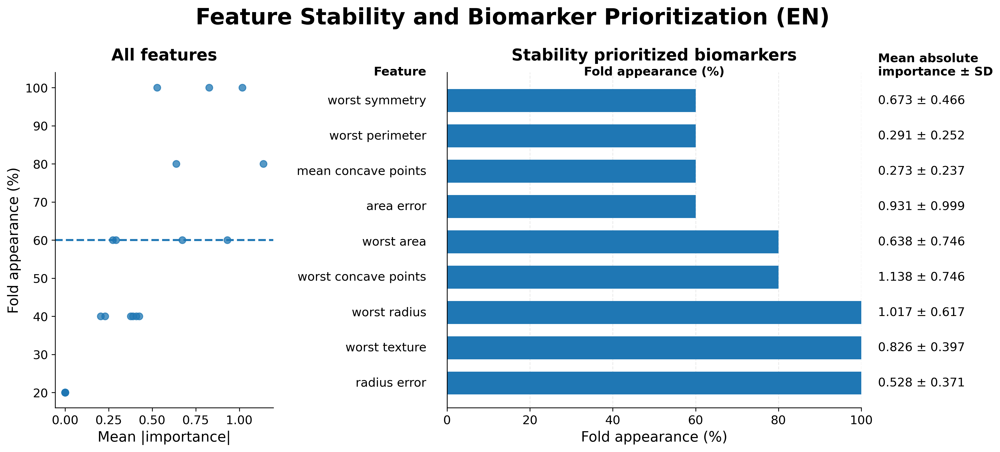
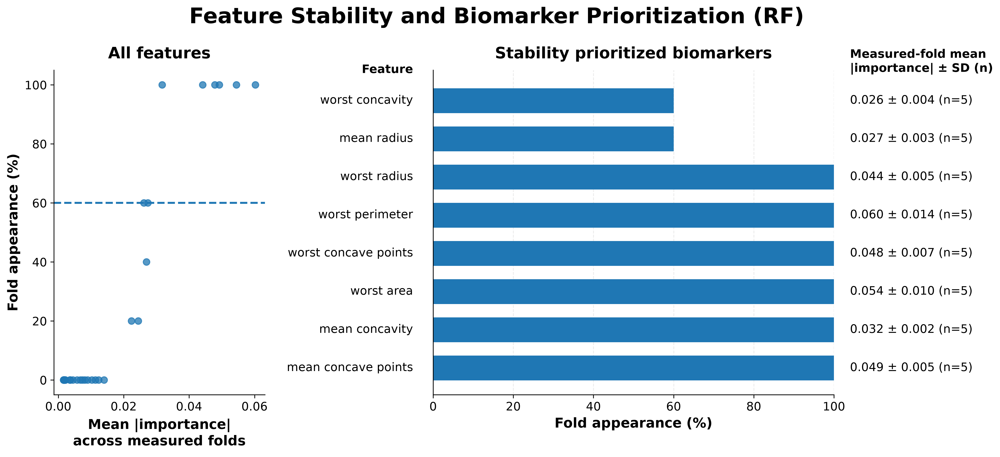
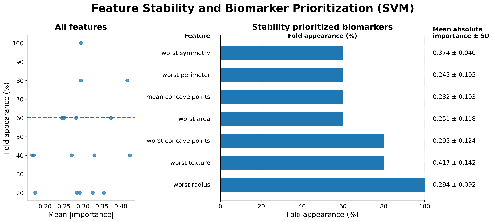
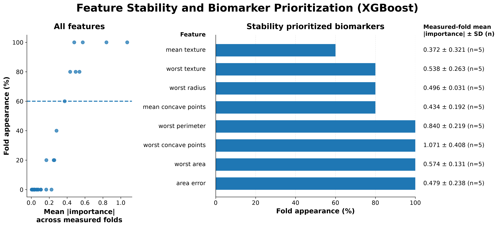
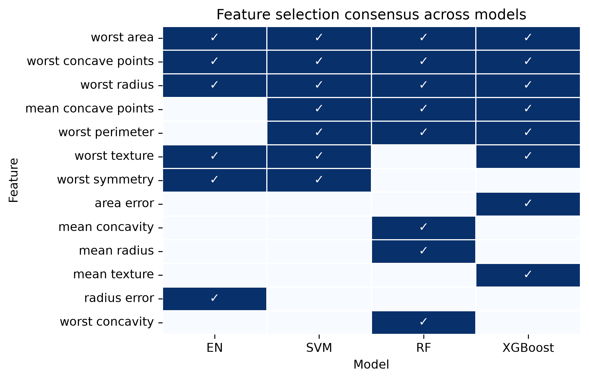

# Stability-Driven Biomarker ML

A machine learning framework for stability-driven biomarker prioritization using cross-validation feature importance, feature stability, and multi-model consensus analysis.

## Overview

Biomarker discovery studies often rely on a single machine learning model, which can introduce model-specific feature selection bias and unstable biomarker prioritization.

This repository implements a cross-model stability framework that identifies biomarkers consistently selected across:

- Multiple machine learning algorithms
- Cross-validation folds

The framework integrates regularized linear and nonlinear machine learning models to improve robustness, interpretability, and reproducibility for translational multi-omics applications.

## Key Features

- Multi-model biomarker discovery pipeline
- Stability-driven feature prioritization using a nested cross-validation framework
- Inner cross-validation for hyperparameter tuning
- Outer cross-validation for feature importance and stability assessment
- Cross-model consensus analysis to reduce model-specific feature selection bias
- SHAP and model-specific feature importance support for interpretable machine learning
- Publication ready visualizations for biomarker stability, cross-model consensus analysis, and model performance
- Modular and extensible Python implementation for translational multi-omics workflows
 
## Supported Models

- Logistic regression with Elastic Net regularization (EN)
- Random Forest (RF)
- XGBoost
- Support Vector Machine (SVM, linear kernel only)

The pipeline is modular and extensible, allowing integration of additional machine learning models.

## Method Overview

```text
Input data and customized model hyperparameters
        ↓ 
Nested cross-validation with multi-model training
(scaling, when configured, fitted inside each training fold)
        ↓ 
Feature importance calculation and ranking within each outer CV fold
        ↓ 
Cross-fold feature importance and stability analysis 
        ↓ 
Cross-model consensus aggregation 
        ↓ 
Robust biomarker prioritization
        ↓
Model evaluation using selected biomarkers on independent hold-out test data
```

## Repository Structure
```text
stability-driven-biomarker-ml/
├── src/           # Core biomarker discovery framework
├── scripts/       # Example analysis workflows
├── configs/       # Customizable model hyperparameter configuration files
├── outputs/       # Generated figures and result tables
├── LICENSE
├── README.md
├── requirements.txt
└── pyproject.toml
```

## Installation
```bash
git clone https://github.com/lingdi-zhang/stability-driven-biomarker-ml.git
cd stability-driven-biomarker-ml
pip install -e .
```

## Requirements

Dependency ranges are bounded for compatibility with XGBoost 2.0.3 and SHAP 0.48.0, including scikit-learn <1.6 and Numba <0.62.

- Python 3.10–3.12
- pandas
- numpy
- scikit-learn
- xgboost
- shap
- matplotlib
- seaborn
- upsetplot

## Example Python Usage

After installation, run this complete example from the repository root:

```python
from pathlib import Path

import pandas as pd
from sklearn.model_selection import train_test_split

from biomarkerML_pipeline import BiomarkerMLPipeline, load_demo_data

project_root = Path.cwd()
output_dir = project_root / "outputs" / "breast_cancer_demo"
outer_cv_params = pd.read_csv(project_root / "configs" / "model_params.txt", sep="\t")

X, y = load_demo_data()
X_discovery, X_holdout, y_discovery, y_holdout = train_test_split(
    X, y, test_size=0.20, stratify=y, random_state=42
)

run_pipeline = BiomarkerMLPipeline(
    outer_cv_params,
    output_dir=output_dir,
    n_jobs_gridsearch=4,
    n_jobs_outer_cv=1,
    n_jobs_models=1,
)

print("Selecting stable biomarkers...")
run_pipeline.stable_biomarker_selection(
    X_discovery, y_discovery,
    feature_importance_selection=0.75,
    cross_folds_selection=0.60,
)

print("Evaluating aggregate biomarkers on the holdout set...")
holdout_metrics = run_pipeline.prediction_with_stable_biomarkers_across_models(
    X_discovery, y_discovery, X_holdout, y_holdout,
    appearance_threshold=0.50,
)
print(holdout_metrics)
```

This example parallelizes grid search across four workers. Use `n_jobs_gridsearch=1` for a serial run. Scaling is fitted inside the cross-validation pipeline when configured; `tune_model=FALSE` uses passthrough scaling.

`output_dir` accepts a string or `Path` and defaults to `outputs` in the current working directory. Missing directories are created automatically.

Parallelization settings can be customized through:

- n_jobs_gridsearch
- n_jobs_outer_cv
- n_jobs_models

Choose one level of parallelization to avoid multiplying worker counts. The example parallelizes grid search; alternatively, use `n_jobs_models` to parallelize models and keep the other settings at 1.

### Input and configuration validation

Feature matrices must be nonempty pandas DataFrames with unique string column names and finite numeric values. Discovery and holdout matrices must contain the same feature columns; column order may differ.

Configuration tables require `Model_name`, `Base_model`, `Parameters`, `Parameter_values`, `Scoring`, and `tune_model`. Values accept Python literals, supported estimator/scaler constructors, and `logspace(...)` or `arange(...)` (also with the `np.` prefix). One-dimensional array results expand into individual tuning candidates: `logspace(-2, 0, 3)` is equivalent to `0.01;0.1;1`. Array expressions can also be combined with semicolon-separated values. When tuning is enabled, blank parameter fields, empty candidate grids, and multidimensional arrays are rejected; estimator/scaler objects remain individual candidates. Arbitrary Python expressions are rejected. Constructor, scoring, and tuning settings must agree across rows for each model.

### Stable Biomarker Selection
```python
run_pipeline.stable_biomarker_selection(
	X_discovery,
	y_discovery,
	feature_importance_selection=0.75,
	cross_folds_selection=0.6
)
```
#### Feature Importance Selection

Within each outer cross-validation fold:

- Linear models rank features using absolute coefficient magnitude
- Tree-based models rank features using absolute SHAP values

Features with importance at or above the specified quantile threshold and greater than zero are selected within that fold.

Default:

```python
feature_importance_selection = 0.75
```
corresponding to approximately the top 25% most important features within each fold. Ties at the quantile can retain more features; zero-importance features are excluded.

#### Cross-Fold Stability Selection

Feature stability is defined as the proportion of folds in which a feature is selected.

Default:

```python
cross_folds_selection = 0.60
```

meaning that features must be selected in at least 60% of outer cross-validation folds to be considered robust biomarkers.

Importance mean and sample SD use all measured fold scores, including scores below the selection threshold and measured zeros. All input features are evaluated in every outer fold. Stability counts selected folds divided by all outer folds. A feature never selected is not retained, even when the stability threshold is zero.

Each run saves `Feature_importance_by_fold_<model>.csv` with scores and selection flags, and `Feature_stability_and_importance_summary_<model>.csv` with mean, SD, measured-fold counts, and stability. Figures show the measurement count (`n`); SD is reported as N/A when only one score was measured. The example figures and CSVs below were regenerated using the current implementation and the full configured parameter grids.

Create a fresh pipeline object for each analysis. Calling `stable_biomarker_selection` again on an existing object invalidates its previous selection results. If the new attempt fails, complete a successful selection run before evaluating holdout data.

### Independent Hold-Out Evaluation
```python
run_pipeline.prediction_with_stable_biomarkers_across_models(
	X_discovery, 
	y_discovery, 
	X_holdout,
	y_holdout,
	appearance_threshold=0.5
)
```
Default:

```python
appearance_threshold = 0.50
```

meaning that selected biomarkers must be identified by at least 50% of machine learning models.

Prediction performance is evaluated using:

- Union of biomarkers across models
- Biomarkers identified by all models
- Biomarkers meeting a user-defined model consensus threshold

Selected features are stored separately in `run_pipeline.model_biomarkers` (one list per selection model) and `run_pipeline.aggregate_biomarkers` (union, intersection, and `consensus_features_for_appearance_threshold`). The consensus group defaults to 50% after selection and is updated using `appearance_threshold` during holdout evaluation. `gene_list` is a compatibility alias containing only model-specific lists. Aggregate group names can also be used as model names without collisions. Newly generated `Model_biomarker_list.csv` files include `group_type` (`model` or `aggregate`) to distinguish these rows.

Holdout evaluation continues to evaluate the three aggregate biomarker groups with every prediction model.

Empty biomarker groups are skipped during holdout evaluation and recorded with `status="no_features"`, `n_features=0`, and missing metrics. Evaluated groups have `status="ok"` and their feature count. If no biomarkers are selected by any model, the biomarker list is still saved and the consensus heatmap is skipped and any previous consensus heatmap in that output directory is removed.

## Breast Cancer Demonstration

The framework includes a demonstration using the Wisconsin Breast Cancer dataset to illustrate:

- Feature importance analysis
- Cross-validation feature stability assessment
- Cross-model biomarker consensus analysis
- Interpretable machine learning workflows

## Quick Start
Run the breast cancer demonstration:

```bash
python scripts/run_breast_cancer_demo.py
```
The demo fixes the data split, cross-validation splits, and estimator random seeds at 42. Exact numerical reproduction also requires matching dependency versions.

For larger datasets, running analyses on an HPC environment is recommended.

## Example Outputs

### Stability vs Importance Analysis

Features are prioritized using both:
- Feature importance within each cross-validation fold
- Feature selection frequency across folds


Default criteria:

- Positive feature importance at or above the 75th percentile within each fold
- Selected in at least 60% of outer cross-validation folds

Features were prioritized based on both their importance within individual cross-validation folds and their consistency across folds. Within each fold, features with positive importance at or above the 75th percentile were considered selected. Ties can retain more than 25% of features. Feature stability was quantified as the percentage of cross-validation folds in which a feature was selected.

This approach prioritizes biomarkers that are both highly informative and reproducible, while reducing sensitivity to individual train-test splits.






Feature stability analysis revealed both shared and model-specific biomarker selection patterns across machine learning algorithms. While individual models prioritized different subsets of features, several biomarkers consistently demonstrated high importance and stability across cross-validation folds.

Cross-validation model performance summaries are available in:
'outputs/breast_cancer_demo/CV_model_performance.csv'.

### Cross-Model Consensus Analysis

Consensus biomarkers selected across models are compared to identify robust features independent of model-specific assumptions.



Cross-model consensus analysis identified three biomarkers (worst area, worst concave points, and worst radius) selected by all four machine learning models. The union contains 13 biomarkers, and 7 meet the ≥50% model-consensus threshold. These results provide a benchmark for comparing cross-model feature stability on the demonstration dataset.

Feature lists are available in:

'outputs/breast_cancer_demo/Model_biomarker_list.csv'.

### Independent Hold-Out Evaluation

The Wisconsin Breast Cancer dataset is a widely used machine learning benchmark containing a relatively small number of highly informative features. As a result, many machine learning models achieve near-ceiling predictive performance on this dataset.

The primary objective of this demonstration is therefore not to maximize prediction accuracy, but to illustrate the framework's ability to:

- Identify stable biomarkers across cross-validation folds
- Compare biomarker selection across multiple machine learning models
- Generate consensus biomarker sets
- Evaluate biomarker robustness on independent hold-out data

Prediction performance is evaluated using:

- Union of biomarkers across models
- Biomarkers identified by all models
- Biomarkers identified by 50% of models
- Across SVM, XGBoost, Random Forest and Elastic Net

| Biomarker Set | Consensus Across Models | Number of Features | ROC-AUC (Mean ± SD) | PR-AUC (Mean ± SD) | F1 (Mean ± SD) |
|--------------|-------------------------|-------------------|---------------------|--------------------|----------------|
| Union of Biomarkers | Any model | 13 | 0.993 ± 0.001 | 0.996 ± 0.001 | 0.966 ± 0.007 |
| Consensus Biomarkers | ≥50% of models | 7 | 0.993 ± 0.001 | 0.996 ± 0.001 | 0.960 ± 0.006 |
| Consensus Biomarkers | 100% of models | 3 | 0.989 ± 0.002 | 0.993 ± 0.001 | 0.954 ± 0.011 |

The table reports mean ± population SD across four classifiers evaluated on the same holdout split; the SD describes variation across models. The ≥50% consensus set reduces the union from 13 to 7 features. The three-feature intersection has lower mean F1 in this run.

Results are available in:

'outputs/breast_cancer_demo/holdout_test_metrics.csv'.

## Real-World Applications

This framework was developed through analysis of biomedical datasets, including blood transcriptomics in allergy and immune-related diseases. 
The breast cancer example is provided as a lightweight reproducible demonstration. In contrast, real-world transcriptomic datasets typically contain substantially higher dimensionality, stronger feature correlation, and greater feature selection instability, motivating the need for stability-driven biomarker prioritization approaches.

### Example Translational Application

Zhang L, Chun Y, Reed K, Grishina G, Lo T, Wang J, Sicherer S, Bunyavanich S. **Oral immunotherapy suppresses peripheral blood transcriptomic response to peanut in peanut allergy.** *Journal of Allergy and Clinical Immunology*. 2026;157(2):398–408. DOI: https://doi.org/10.1016/j.jaci.2025.10.030

As first author of this study, I applied machine learning, transcriptomic biomarker analysis, and longitudinal clinical data integration to characterize peripheral blood transcriptional responses associated with peanut oral immunotherapy. The analytical principles implemented in this repository, including biomarker prioritization, feature stability assessment, multi-model evaluation, and translational biomarker discovery, were developed and refined through real-world applications in high-dimensional biomedical datasets.

## Why Cross-Model Stability?

Different machine learning algorithms prioritize features differently due to:

- linear versus nonlinear assumptions
- regularization behavior
- correlated feature handling
- interaction modeling

Rather than relying on a single model-specific ranking, this framework prioritizes biomarkers repeatedly identified across diverse learning algorithms and resampling procedures.

This approach helps:
- Reduce model-specific bias
- Improve robustness
- Increase reproducibility
- Enhance confidence in candidate biomarker prioritization

By combining feature importance, cross-validation stability, and cross-model consensus, the framework prioritizes biomarkers that are more likely to generalize across independent datasets and analytical approaches.

Additional machine learning models can be incorporated into the framework through the modular architecture.

## License

This project is released under the MIT License. See the LICENSE file for details.

## Contact

### Lingdi Zhang

Computational Biologist | Multi-omics | Biomarker Discovery 

GitHub: https://github.com/lingdi-zhang

LinkedIn: https://www.linkedin.com/in/lingdi-zhang-88156792

## Regression tests

```bash
pip install -e ".[test]"
python -m pytest -q
```
